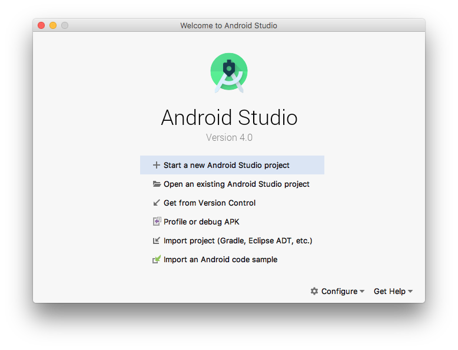
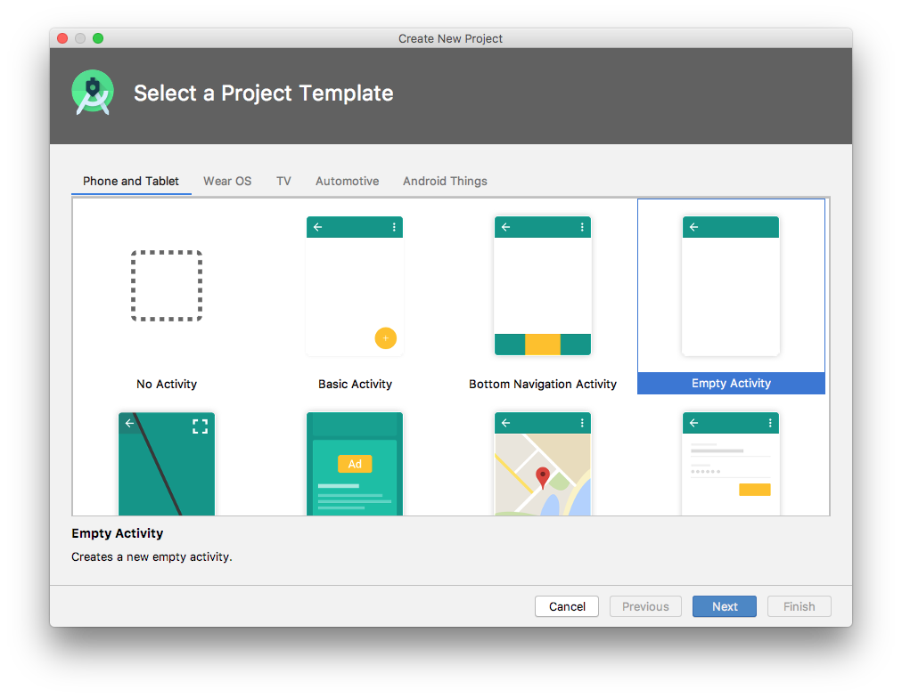
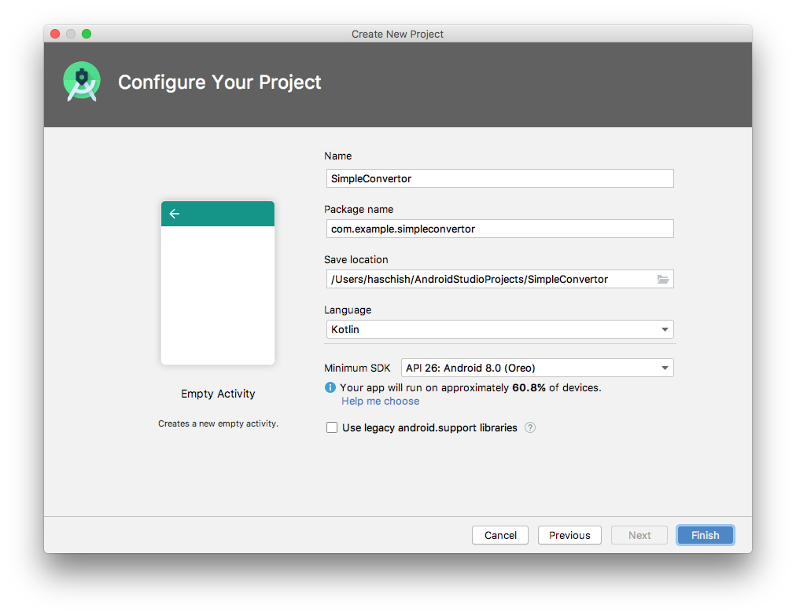

Первым шагом в процессе разработки приложения является создание нового проекта в среде Android Studio. Поэтому начните с запуска Android Studio, чтобы появился экран ```Welcome to Android Studio```.



После появления этого окна Android Studio готова к созданию нового проекта. Чтобы создать новый проект, просто нажмите кнопку ```Start a new Android Studio project```, чтобы отобразить первый экран мастера создания нового проекта.

## Создание активности
Сперва необходимо определить тип начальной активности, которая должна будет создана для приложения. Доступны параметры для создания проектов для Phone and Tablet, Wear OS, TV, Android Audio или Android Things. При разработке приложений для Android доступен ряд различных типов активностей, многие из которых будут подробно рассмотрены в последующих главах. Для целей этого примера, просто выберите опцию **Empty Activity** на вкладке ```Phone and Tablet```. Выбор Empty Activity создаст шаблонный пользовательский интерфейс, состоящий из одного объекта TextView.



Выбрав опцию **Empty Activity**, нажмите **Next**, чтобы продолжить настройку проекта.

## Конфигурация проекта и настроек SDK
В окне конфигурации проекта установите для поля **Name** значение ```SimpleConvertor```. Имя приложения - это имя, на которое будет ссылаться и идентифицироваться приложение в Android Studio, а также имя, которое будет использоваться, если готовое приложение поступит в продажу в магазине Google Play. Поле **Package name** используется для уникальной идентификации приложения в экосистеме приложений Android. Хотя здесь может быть установлена любая строка, которая однозначно идентифицирует ваше приложение, обычно она основывается на обратном URL-адресе вашего доменного имени, за которым следует имя приложения. Например, если ваш домен *www.mycompany.com*, а приложение названо SimpleConvertor, тогда имя пакета может быть указано следующим образом: 
```
com.mycompany.simpleconvertor
```
Если у вас нет доменного имени, вы можете ввести любую другую строку в месте домена, или вы можете использовать example.com для целей тестирования: 
```
com.example.simpleconvertor
```

Поле **Save location** по умолчанию будет иметь местоположение в папке с именем AndroidStudioProjects, расположенной в вашем домашнем каталоге, и его можно изменить, щелкнув значок папки справа от текстового поля, содержащего текущий параметр пути.

Установите минимальное значение SDK для API 26: Android 8.0 (Oreo). Этот SDK будет использоваться в большинстве проектов, созданных у нас на курсе.



Наконец, измените в поле **Language** на ```Kotlin``` и нажмите **Finish**, чтобы начать процесс создания проекта.
